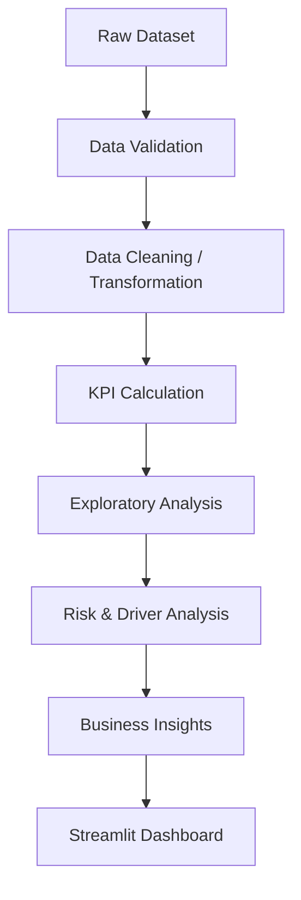
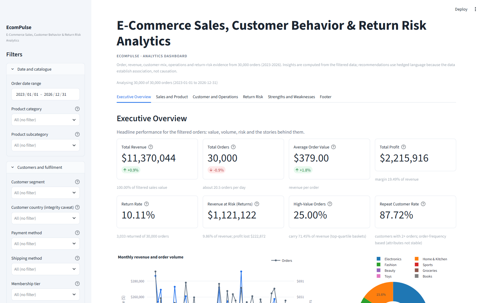
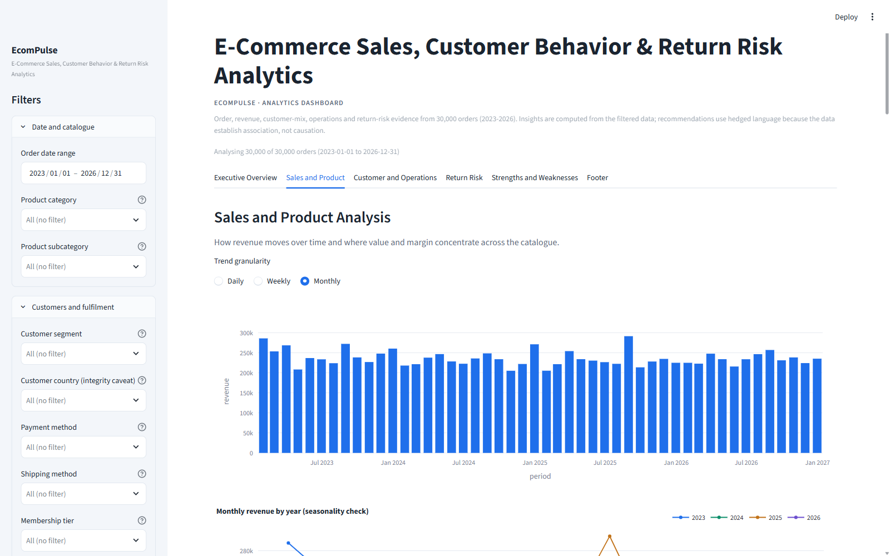
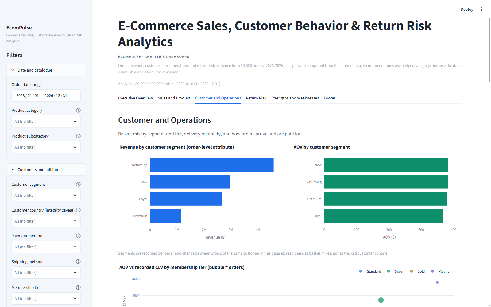
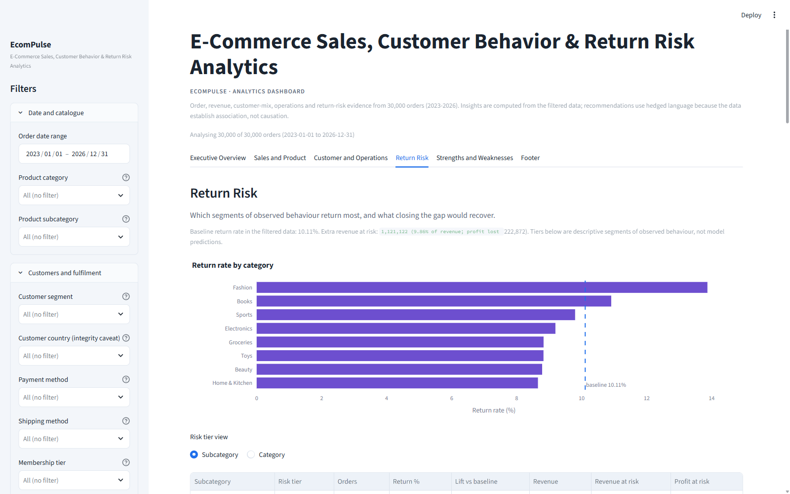
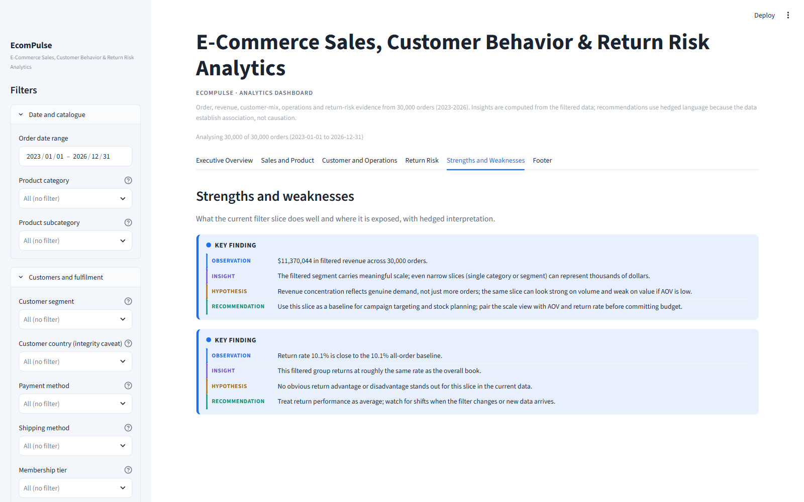
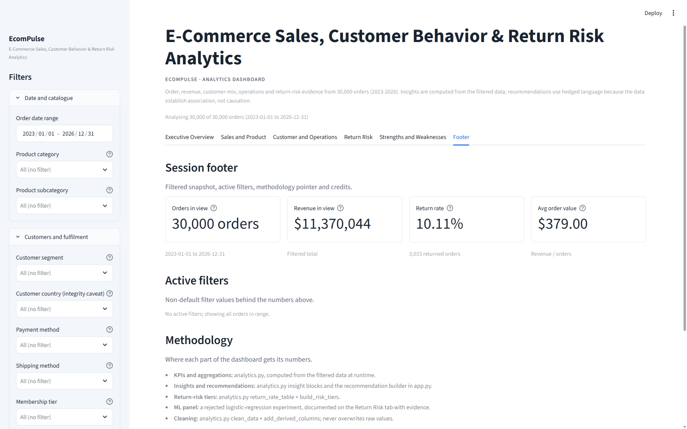

# 📊 EcomPulse

**E-Commerce Sales, Customer & Return Analytics**

> 🔗 **Repository:** [github.com/chandu8861/BharatCares-Internship-Project](https://github.com/chandu8861/BharatCares-Internship-Project)

EcomPulse is an interactive Streamlit analytics dashboard that turns a 30,000-order e-commerce dataset (2023-2026) into trust-checked KPIs, trend, performance, customer, and return-risk analysis -- with full data-quality and methodology transparency.

<div align="center">


[](https://github.com/chandu8861/BharatCares-Internship-Project)
[](https://www.kaggle.com/datasets/mmumairkhattak/e-commerce-orders-dataset-2026-scra)

</div>

### 📌 Results at a Glance

| Metric | Value |
|---|---|
| Total Revenue | $11,370,043.99 |
| Total Profit | $2,215,916.27 (19.49% margin) |
| Average Order Value | $379.00 |
| Return Rate | 10.11% (3,033 orders) |
| Revenue at Risk (returns) | $1,121,122 |
| Profit at Risk (returns) | $222,872 |
| Discount Spend | $1,482,982.26 |
| Revenue Concentration | Top 25% of orders drive 71.45% of revenue |
| Category Concentration | Electronics: 55.59% of revenue on 15.66% of orders |
| Return Prediction (rejected) | AUC ~0.54 - model deliberately not deployed |

> All figures are computed from the cleaned dataset and update live with dashboard filters. See [Key Business Insights](#-key-business-insights) for interpretation.

---

## ✨ Features

- Interactive KPI dashboard with live filters
- Sales, revenue and trend analysis
- Product, category and brand performance analysis
- Customer segmentation and operational analysis
- Return-risk analysis with revenue/profit at risk
- Business insights and recommendations derived from the data
- Data-quality and methodology transparency (cleaning log, integrity checks)
- Filtered data export for downstream use

---

## 🏗️ Architecture / Workflow



**Stage notes**

1. **Raw Dataset** -- the 41-column Kaggle dataset covering 30,000 orders from 2023 to 2026.
2. **Data Validation** -- `run_quality_checks()` verifies required columns, null/duplicate counts, formula tolerances, and cross-field integrity (e.g. `Returned` vs `Order_Status`, attribute stability).
3. **Data Cleaning / Transformation** -- `clean_data()` normalises types/casing, drops duplicate rows and Order IDs, and backfills only missing `Discount_Amount`/`Profit_Amount` from verified subtotal formulas; originals are preserved.
4. **KPI Calculation** -- `compute_kpis()` derives the live KPI set over the filtered frame.
5. **Exploratory Analysis** -- trend, category, discount, delivery and frequency aggregations.
6. **Risk & Driver Analysis** -- `build_risk_tiers()`, `return_driver_scan()`, `fashion_opportunity()` segment losses and flag return drivers.
7. **Business Insights** -- each insight is generated from the numbers it describes (observation → insight → recommendation).
8. **Streamlit Dashboard** -- `app.py` renders the KPI row and six themed tabs.

---

## 🧰 Tech Stack

| Layer | Technology |
|---|---|
| Language | Python 3.11+ |
| Dashboard | Streamlit |
| Data Analysis | Pandas, NumPy |
| Visualization | Plotly |
| Data Source | Kaggle |

> No scikit-learn and no matplotlib are used. The return-risk section is deliberately descriptive rather than predictive -- see the ML decision section.

## 📊 Dashboard

EcomPulse presents the analytics through a KPI header plus six tabs:

- **Executive Overview** -- headline KPI cards and the narrative summary of the period.
- **Sales & Product** -- revenue/AOV trends, category/subcategory/brand breakdowns, discount behaviour.
- **Customer & Operations** -- segment, age, membership, country and operational breakdowns.
- **Return Risk** -- return drivers, revenue/profit at risk, risk tiers, and the rejected-ML evidence.
- **Strengths & Weaknesses** -- dataset strengths, weaknesses and analytical caveats.
- **Data & Method Notes** -- cleaning log, quality checks, and integrity notes.

---

## 🖼️ Dashboard Screenshots

All screenshots were captured from the running Streamlit app at `http://localhost:8501`.

<p align="center">
  
  <br><sub>1. Executive Overview -- KPI cards and headline narrative</sub>
</p>

<p align="center">
  
  <br><sub>2. Sales and Product -- trends, category/brand performance, discounts</sub>
</p>

<p align="center">
  
  <br><sub>3. Customer and Operations -- segmentation and logistics views</sub>
</p>

<p align="center">
  
  <br><sub>4. Return Risk -- drivers, at-risk totals, risk tiers and ML-rejection evidence</sub>
</p>

<p align="center">
  
  <br><sub>5. Strengths and Weaknesses -- dataset strengths and analytical caveats</sub>
</p>

<p align="center">
  
  <br><sub>6. Data and Method Notes -- cleaning log, quality checks and caveats</sub>
</p>

---

## 📈 Key KPIs

The dashboard reports the following KPIs (all over the active filter frame):

- **Orders**
- **Revenue**
- **Profit**
- **Average Order Value (AOV)**
- **Return Rate**
- **High-Value Share**
- **Repeat Order Rate**
- **Average Rating**
- **Average Delivery Days**
- **Revenue at Risk**

---

## 🔍 Key Business Insights

Findings are read directly from the numbers in the dashboard.

**Sales concentration**

- Observation: Electronics account for ~55.59% of revenue on only ~15.66% of orders; the top quartile of baskets (about $388.19+, ~25% of orders) generate ~71.45% of revenue.
- Business implication: a small slice of high-value and Electronics orders drives most revenue, so those segments carry disproportionate risk.
- Recommendation: protect the high-value funnel with focused service; avoid over-discounting the basket that already carries margin.

**Returns**

- Observation: the overall return rate is ~10.11% (3,033 orders), putting roughly **$1.12M** of revenue and **$222K** of profit at risk.
- Business implication: returns are a material cost, concentrated where risk tiers flag it.
- Recommendation: act on the flagged return drivers and risk tiers rather than modelling returns blindly (see ML decision).

**Discount behaviour**

- Observation: discount spend totals about **$1.48M**; high-value baskets already convert well.
- Business implication: broad discounting erodes margin on orders that may not need it.
- Recommendation: shift discounts toward acquisition and re-engagement of lower-value first-time buyers instead of inflating already-large baskets.

> Correlations here are descriptive, not causal. Recommendations are framed as testable actions.

---

## 🧪 Return Risk & ML Decision

The project evaluated whether a predictive return model was appropriate before building the dashboard:

- A leakage-free return-prediction probe measured AUC ≈ **0.54** (essentially random).
- Post-outcome fields such as `Review_Rating` and `Order_Status = Returned` were recognised as leakage sources and excluded from any driver reasoning.
- Because the dataset cannot support a reliable predictor, the final dashboard uses **descriptive return-risk analysis** (driver scan, risk tiers, loss segmentation) rather than deploying an unreliable model.

This is an explicit **"rejection, not a model"** decision documented inside the app, so users are never shown a prediction the data cannot support.

---

## 🔄 Data Pipeline

| Step | Description |
|---|---|
| Data loading | `load_raw()` reads `data/ecommerce_orders_dataset.csv` with graceful fallbacks |
| Validation | `validate_schema()` + `REQUIRED_COLUMNS` check; affected charts degrade, the app never crashes |
| Cleaning | `clean_data()` normalises types/casing, drops duplicate rows and Order IDs, logs every action |
| Feature derivation | `add_derived_columns()` adds flags and keys; null backfills use verified formulas only |
| KPI calculation | `compute_kpis()` computes the live KPI set over the filtered frame |
| Risk analysis | `build_risk_tiers()`, `return_driver_scan()`, `fashion_opportunity()` |
| Dashboard | `app.py` renders the KPI row and six themed tabs with active filter state |

---

## 📁 Project Structure

```text
EcomPulse/
├── app.py
├── analytics.py
├── requirements.txt
├── implementation_plan.md
├── data/
│   ├── ecommerce_orders_dataset.csv
│   └── data_dictionary.csv
├── assets/
│   ├── 01-executive-overview.png
│   ├── 02-sales-and-product.png
│   ├── 03-customer-and-operations.png
│   ├── 04-return-risk.png
│   ├── 05-strengths-and-weaknesses.png
│   └── 06-footer.png
├── .streamlit/
│   └── config.toml
└── README.md
```

---

## 🚀 Getting Started

### 1. Clone the repository

```bash
git clone https://github.com/chandu8861/BharatCares-Internship-Project.git
cd BharatCares-Internship-Project
```

### 2. Create and activate a virtual environment

```bash
python -m venv .venv

# Windows (PowerShell / CMD)
.venv\Scripts\activate

# macOS / Linux
source .venv/bin/activate
```

### 3. Install dependencies

```bash
pip install -r requirements.txt
```

### 4. Add the dataset

> The dataset is not committed to GitHub. Download `ecommerce_orders_dataset.csv` and `data_dictionary.csv` from the [Kaggle source](https://www.kaggle.com/datasets/mmumairkhattak/e-commerce-orders-dataset-2026-scra) and place them in the `data/` folder:

```text
data/
├── ecommerce_orders_dataset.csv
└── data_dictionary.csv
```

### 5. Run the dashboard

```bash
streamlit run app.py
```

Open http://localhost:8501 in your browser.

---

## 📦 Dataset

**Source:** [e-commerce-orders-dataset-2026-scra (Kaggle)](https://www.kaggle.com/datasets/mmumairkhattak/e-commerce-orders-dataset-2026-scra)

- **30,000** orders
- **41** columns
- Coverage: 2023-2026
- Synthetic dataset
- Includes `data/data_dictionary.csv` with column definitions

---

## ⚠️ Data Limitations & Integrity Notes

- **Customer IDs are not a stable master.** Age, gender, segment, country, city, membership and lifetime value can change between orders for the same ID, so customer/segment views are order-level mixes, not tracked cohorts.
- **Product IDs are not a product master.** A single product ID can map to several categories, subcategories, brands and prices, so performance is analysed at category/subcategory/brand level only.
- **Country and City are independently assigned** (all combinations appear); country is shown as a marginal split and city is not mapped to it.
- **`Returned` equals `Order_Status = Returned`** exactly - they are one outcome, not two signals.
- **`Review_Rating` is a post-delivery outcome** (sharply lower for returned orders). It is shown for context only and never used as a driver or predictor.
- **`High_Value_Order`** is a top-quartile label on `Order_Amount` (threshold about $388.19), a classificatory convenience rather than a behaviour.

---

## 🔮 Future Enhancements

- Real, stable customer and product master data to enable true cohort/LTV analysis.
- Automated data refresh / scheduled runs for live data.
- Better return prediction only if genuine pre-return behavioural data becomes available (the current AUC ~0.54 rules out a usable predictor).
- Cloud-native deployment (e.g. Streamlit Community Cloud).

---

## 👨‍💻 Project

**EcomPulse** was built as part of the BharatCares internship programme - a portfolio project demonstrating reproducible, trustworthy analytics over a messy e-commerce dataset, with deliberate restraint where the data does not support a claim.

🔗 **Source code:** [github.com/chandu8861/BharatCares-Internship-Project](https://github.com/chandu8861/BharatCares-Internship-Project)

---

<div align="center">

⭐ If you found this project useful, consider starring the repository!

</div>
